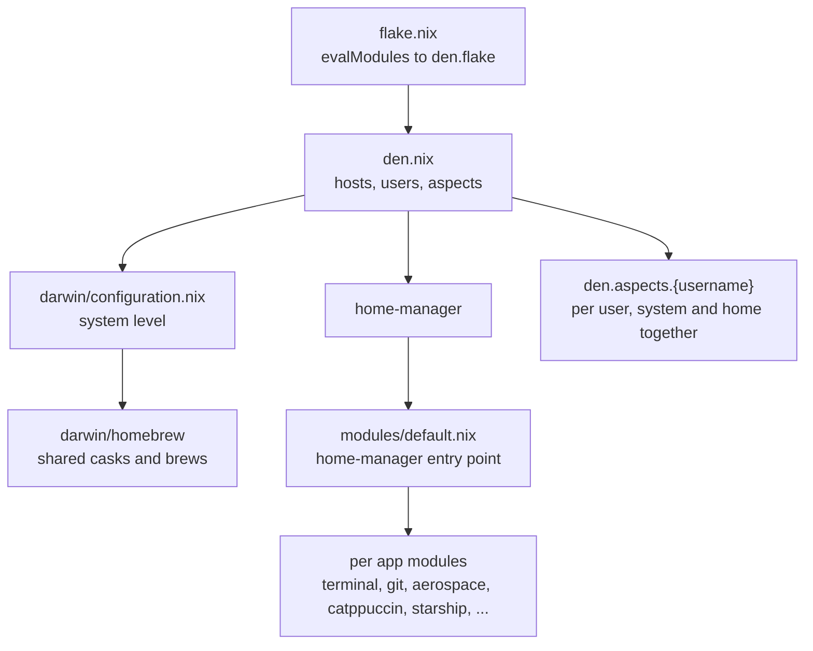

<div align="center">

# My Nix Configs ❄️

</div>

<div align="center"></div>

## Motivation

Setting up a new laptop from scratch can be an incredibly time-consuming and tedious process. Installing all your favorite tools, configuring your environment, tweaking settings to your preferences, and ensuring everything works together seamlessly often takes hours or even days. Even worse, you have to repeat this painful process every time you get a new machine or need to restore your system.

This is where Nix Darwin comes to the rescue. My motivation for adopting Nix Darwin is simple: eliminate the repetitive burden of manual system configuration. With Nix, I can define my entire system setup in code once, and then deploy it consistently across all my devices. Whether I'm setting up a new MacBook or recovering from a system failure, I can have my perfect development environment up and running in minutes, not hours. One configuration to rule them all.

## What is Nix?

Nix is a powerful package manager and system configuration tool that takes a unique approach to software management. Unlike traditional package managers, Nix treats packages as immutable building blocks and uses a functional approach to system configuration.

### Key Benefits

- **Reproducibility**: Your system configuration produces the same results every time, eliminating "works on my machine" problems.
- **Declarative Configuration**: Declare what your system should look like in configuration files, and Nix handles the rest.
- **Atomic Updates and Rollbacks**: System changes either fully succeed or fail. Roll back to previous configurations instantly if needed.
- **Isolation**: Packages are installed in isolation, preventing dependency conflicts. Multiple versions can coexist peacefully.
- **Cross-Machine Consistency**: Use the same configuration across multiple machines for identical setups everywhere.

By leveraging Nix Darwin for macOS, I get all these benefits while maintaining a native Mac experience.

## Structure

`flake.nix` is thin: it evaluates `den.nix` and re-exports the `darwinConfigurations` that [den](https://github.com/denful/den) builds. `den.nix` declares each host and its user as entities, and holds the per user config.

System level settings live under `darwin/`, and everything user level is home-manager config under `modules/`, with `modules/default.nix` as the entry point.

Per user overrides live in a den aspect named after the user. An aspect can carry both halves of a feature at once, so a user's Homebrew casks and their home-manager config sit in the same block instead of in two separate trees.



## What's Inside (Home Manager)

All the following applications are managed via home-manager and will be configured automatically on rebuild.

### Shell & Terminal
| Application | Description |
|---|---|
| Fish | Shell with built-in completion, autosuggestion and syntax highlighting; Atuin powers history search (Ctrl-R) |
| Starship | Cross-shell prompt |
| Kitty | GPU-accelerated terminal |
| Ghostty | Fast terminal emulator |

Kitty and Ghostty are both configured, but only one is active per host. The choice is a single `terminal` field on the host in `den.nix` (see the Configuration section) that drives both the Homebrew cask and the program config, so the two never drift apart.

### Development Tools
| Application | Description |
|---|---|
| Neovim (nixvim) | Text editor, configured declaratively in `modules/nixvim/` |
| Git | Version control |
| Lazygit | Terminal UI for Git |
| tmux | Terminal multiplexer |
| Zed | Modern, high-performance code editor |

### AI / Agentic Tools
Sourced from the [numtide/llm-agents.nix](https://github.com/numtide/llm-agents.nix) flake input (see `modules/llm-agents/default.nix`).

| Application | Description |
|---|---|
| Claude Code | Agentic coding tool from Anthropic |
| OpenCode | AI coding assistant |
| pi | Agent CLI, with its plugin set declared alongside it |
| herdr | Terminal UI for running and watching coding agents |
| herdr-annotate | Plannotator plugin for herdr, linked on activation |
| hunk | Diff review tool, also set as git's pager |
| Beads | Issue/task tracker for AI coding agents |
| beads-viewer | Web viewer for a beads database |
| agent-browser | Browser automation for agents |
| RTK | Rust Token Killer, a token-optimizing CLI proxy |
| codebase-memory-mcp | MCP server indexing a repo into a code knowledge graph |
| fff-mcp | MCP server exposing the fff frecency-ranked file finder |

### CLI Utilities
| Application | Description |
|---|---|
| atuin | Shell history search (SQLite-backed, Ctrl-R) |
| bat | `cat` clone with syntax highlighting |
| btop | Resource monitor |
| eza | Modern `ls` replacement |
| yazi | Terminal file manager |
| zoxide | Smarter `cd` with frecency-based navigation |
| gh | GitHub CLI |
| presenterm | Terminal slideshow presentation tool |

### Desktop & UI
| Application | Description |
|---|---|
| Aerospace | Tiling window manager |
| Sketchybar | Custom menu bar |
| JankyBorders | Rounded colored borders for focused windows |


## Usage

### Get to know Nix

New to Nix? No problem! While this repository is ready to use, having a basic understanding of how Nix works will help you customize it to fit your needs. The learning curve might seem steep at first, but trust me, it's worth every minute you invest.
I highly recommend starting with these excellent introductory resources to get yourself familiar with the core concepts:
- [Zero to nix](https://zero-to-nix.com/)
- [Nix explain from the ground up](https://youtu.be/5D3nUU1OVx8?si=ci8qjZqPHZc8I-P7)
- [Nix package manager for macOS](https://youtu.be/Z8BL8mdzWHI?si=iZcXCLDPtG-8fx0w)

### Prerequisite

1. Install nix

```
sh <(curl --proto '=https' --tlsv1.2 -L https://nixos.org/nix/install)
```

2. Clone this repository
```
# ensure you're in home dir
git clone https://github.com/derangga/dotfiles.git nix
```

### Configuration

1. Add your host inside `den.hosts.aarch64-darwin` in `den.nix`. The `terminal` field accepts `"ghostty"` or `"kitty"` and drives both the Homebrew cask and the program config. The `instantiate` override is what hands `hostname`, `username` and `terminal` to the modules that read them.
```nix
den.hosts.aarch64-darwin = {
  # existing hosts ...

  # Add your hostname here, you can check by running hostname
  foo = {
    terminal = "ghostty";
    users.foobar = { };
    instantiate = mkDarwin {
      hostname = "foo";
      username = "foobar";
      terminal = "ghostty";
    };
  };
};
```

2. Add an aspect named after the user. den resolves `den.aspects.{username}` for that user on its own, so nothing wires the two together. One aspect holds both the system half and the home-manager half.
```nix
den.aspects.foobar = {
  includes = [
    den.batteries.define-user
    den.batteries.primary-user
  ];

  # system half: casks only this user wants
  darwin.homebrew.casks = [ "obs" ];

  # home-manager half
  homeManager =
    { pkgs, ... }:
    {
      home.packages = with pkgs; [ ];
    };
};
```

The `define-user` battery creates the account and sets `home.username` and `home.homeDirectory`. The `primary-user` battery sets `system.primaryUser`. Neither needs to be written by hand.

Shared home-manager config, including the `drb` and `ngc` abbreviations, lives in `modules/default.nix` and applies to every user.

3. Now you can build it. Since this is a first time you can't use the alias yet
```
sudo darwin-rebuild switch --flake ~/nix#foo
```

## Agentic Tools

Everything in the table above is declared in `modules/llm-agents/default.nix` and installed automatically on rebuild.

`codebase-memory-mcp` is wired per-project rather than globally — see `modules/llm-agents/docs/codebase-memory/mcp-integration.md` for the `.mcp.json` / `opencode.json` blocks, and `modules/llm-agents/docs/codebase-memory/quick-start.md` for manual CLI use.

`herdr` gets its config and keybindings from the same module, and `herdr-annotate` is linked into it by a home-manager activation hook — see `modules/llm-agents/docs/herdr-plannotator-quickstart.md`.

## Resources
- [Nix store](https://search.nixos.org/packages?channel=25.11&)
- [Home manager](https://home-manager-options.extranix.com/)
- [Nix darwin](https://mynixos.com/nix-darwin)

## License

This project is licensed under the MIT License - see the [LICENSE](LICENSE) file for details.

